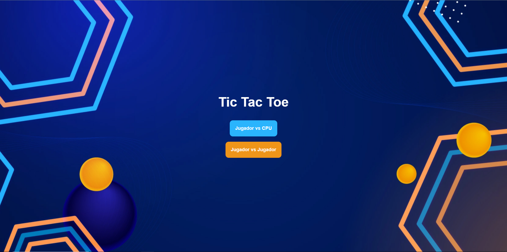
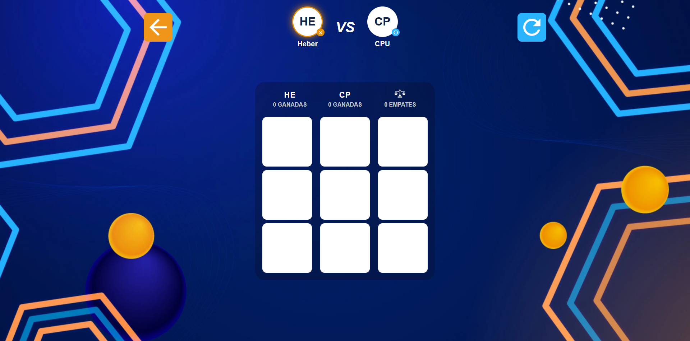

# Tic Tac Toe

Juego de Tres en Raya desarrollado con HTML, CSS y JavaScript vanilla. Incluye dos modos de juego, marcador persistente y una interfaz completa con pantallas de carga, menú, registro de jugadores y modales de resultado.

## Capturas

| Menú principal | Registro de jugador | Tablero de juego |
|:---:|:---:|:---:|
|  |  |  |

## Características

- Pantalla de carga con barra de progreso
- Menú para elegir modo: **Jugador vs CPU** o **Jugador vs Jugador**
- Validación de nombres (mínimo 3 caracteres)
- Tablero interactivo 3×3 con detección de victoria y empate
- Marcador de victorias y empates persistente
- Animación visual del movimiento de la CPU
- Modales de victoria, derrota y empate

## Tecnologías

| Tecnología | Uso |
|------------|-----|
| HTML5 | Estructura de las pantallas |
| CSS3 | Estilos y diseño visual |
| JavaScript | Lógica del juego y eventos del DOM |
| localStorage | Guardar nombres, turnos y marcador |

## Cómo ejecutar

1. Clona el repositorio:

```bash
git clone https://github.com/heberlj/heber-tictactoe.git
```

2. Abre `index.html` en tu navegador.

> También puedes usar la extensión **Live Server** en VS Code para una mejor experiencia de desarrollo.

**Opción 2 — Demo en línea:**

Visita [https://whimsical-nougat-d9af65.netlify.app/](https://whimsical-nougat-d9af65.netlify.app/)


## Cómo jugar

1. Espera la pantalla de carga y pulsa **INICIAR**
2. Elige **Jugador vs CPU** o **Jugador vs Jugador**
3. Ingresa el nombre de los jugadores (mínimo 3 caracteres)
4. Haz click en las celdas del tablero para jugar
5. El marcador se actualiza automáticamente entre rondas

## Flujo de la aplicación

```
index.html          → Pantalla de carga
selectmode.html     → Menú principal
name1player.html    → Registro 1 jugador (modo CPU)
name2players.html   → Registro 2 jugadores (modo PVP)
dashboard.html      → Tablero y lógica del juego
```

## Estructura del proyecto

```
├── index.html           # Pantalla de carga
├── selectmode.html      # Menú principal
├── name1player.html     # Registro de 1 jugador
├── name2players.html    # Registro de 2 jugadores
├── dashboard.html       # Pantalla del juego
├── dashboard.js         # Lógica del tablero, turnos, CPU y marcador
├── nameplayers.js       # Validación y guardado de nombres
├── main.css             # Estilos compartidos
├── loading.css          # Estilos de la pantalla de carga
├── dashboard.css        # Estilos del tablero
├── name1player.css      # Estilos pantalla 1 jugador
├── name2players.css     # Estilos pantalla 2 jugadores
└── assets/
    ├── icons/           # Iconos del juego
    └── img/             # Capturas de pantalla (Cap1, Cap2, Cap3)
```

## Decisiones técnicas

- **Varias páginas HTML** en lugar de una SPA, para mantener el proyecto simple y fácil de mantener.
- **Un solo script** (`nameplayers.js`) reutilizado en ambas pantallas de nombres, detectando el modo según los elementos del DOM.
- **localStorage** para pasar datos entre pantallas y persistir el marcador sin necesidad de backend.
- **CPU básica** que elige celdas vacías al azar, con animación de cursor para mejorar la experiencia visual.

## Mejoras futuras

- IA más inteligente (bloquear jugadas ganadoras, intentar ganar)
- Tests unitarios para la lógica del juego
- Modo online con WebSockets
- Sonidos incluidos

## Autor

**Heber** — [GitHub](https://github.com/heberlj)
